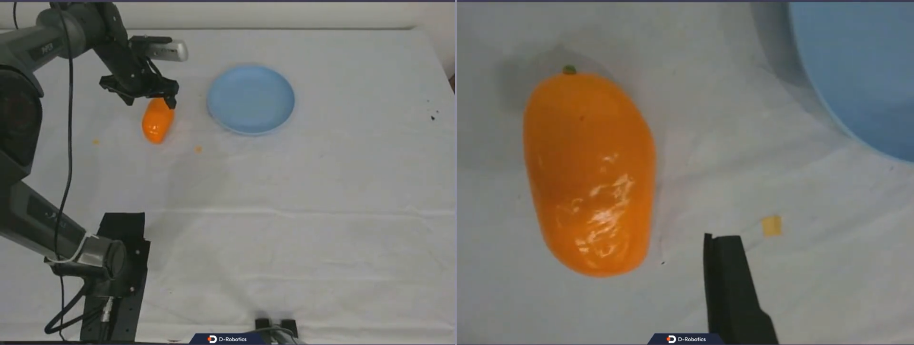

English | [简体中文](./README_cn.md)

# OpenPI Runtime S600 Inference Node

## Overview

OpenPI Runtime is a Vision-Language-Action (VLA) model inference runtime based on the quantized deployment of [Pi0](https://github.com/Physical-Intelligence/openpi). This project implements an end-to-end control flow for the S600 robotic arm, generating action sequences and controlling the robotic arm execution based on camera images and arm state combined with user instructions.

This system adopts a client-server architecture: the S600 inference node acts as the client responsible for data collection, preprocessing, and action execution; the Pi0 inference model serves as the server responsible for action prediction.

## System Architecture

```
┌─────────────────────────────────────────────────────────────────┐
│                    S600 Inference Node System Architecture       │
├─────────────────────────────────────────────────────────────────┤
│                                                                 │
│  ┌──────────────┐    ┌──────────────┐    ┌──────────────┐      │
│  │  Head Camera │    │ Left Wrist   │    │ Right Wrist  │      │
│  │  /camera/    │    │ /camera_left/│    │  (Black)     │      │
│  │  camera/     │    │ camera_left/ │    │              │      │
│  │  color/      │    │ color/       │    │              │      │
│  │  image_raw   │    │ image_raw    │    │              │      │
│  └──────┬───────┘    └──────┬───────┘    └──────┬───────┘      │
│         │                   │                   │               │
│         └───────────────────┼───────────────────┘               │
│                             ▼                                   │
│              ┌──────────────────────────────┐                  │
│              │     Topic Synchronizer       │                  │
│              │  TopicTimeSynchronizer       │                  │
│              │   Time Window: 100ms         │                  │
│              └──────────────┬───────────────┘                  │
│                             ▼                                   │
│         ┌───────────────────────────────┐                       │
│         │        S600 Inference Node    │                       │
│         │   s600_inference_node.py      │                       │
│         ├───────────────────────────────┤                       │
│         │  1. Data Collection (0.1ms)   │                       │
│         │  2. Preprocessing (3.2ms)    │                       │
│         │  3. Inference (192.5ms)      │                       │
│         │  4. Postprocessing (0.1ms)   │                       │
│         │  5. Action Interpolation      │                       │
│         │     and Filtering             │                       │
│         └───────────────┬───────────────┘                       │
│                         ▼                                       │
│              ┌─────────────────────┐                            │
│              │   Pi0 Inference      │                            │
│              │   Server (OE-LLM)    │                            │
│              └──────────┬──────────┘                            │
│                         ▼                                       │
│              ┌─────────────────────┐                            │
│              │    piper_node        │                            │
│              │  Robotic Arm Control │                            │
│              └─────────────────────┘                            │
│                                                                 │
└─────────────────────────────────────────────────────────────────┘
```

## Key Features

- **Multi-camera Synchronized Acquisition**: Supports synchronized image acquisition from head and left wrist cameras, right wrist uses black image placeholder
- **Topic Time Synchronization**: Based on ROS2 topic timestamp synchronization to ensure data consistency
- **End-to-end Low Latency**: Data collection → Preprocessing → Inference → Postprocessing → Execution, full pipeline latency monitoring
- **Action Smoothing**: First action interpolates from current state, last action converges smoothly, intermediate actions use first-order low-pass filtering
- **Joint and Gripper Separate Control**: 6 joints use filtering and interpolation, gripper state published directly

## Technical Specifications

### Input Data Format

| Data Type | Shape | Data Type | Description |
|-----------|-------|-----------|-------------|
| Image Data (3 channels) | [3, 224, 224] | uint8 | Head camera, left wrist camera, right wrist camera (black) |
| State Data | [14] | float32 | Left arm and right arm joint and gripper states |
| Prompt | - | string | User instruction, e.g., "put the yellow mango on the blue plate" |

### Output Action Format

| Data Type | Shape | Data Type | Description |
|-----------|-------|-----------|-------------|
| Action Sequence | [50, 14] | float32 | 50 timesteps, each containing 6 joints + gripper for left arm, and 6 joints + gripper for right arm |

### Performance Metrics

| Stage | Average Latency | Description |
|-------|-----------------|-------------|
| Data Collection | 0.1ms | ROS2 topic synchronization and data acquisition |
| Preprocessing | 3.2ms | Image format conversion, normalization, tokenization |
| Inference | 192.5ms | Pi0 model inference (server-side) |
| Postprocessing | 0.1ms | Action decoding, Delta restoration |
| Action Execution | 700.5ms | 50 actions + interpolation, approximately 70 timesteps |

## Development Environment

| Item | Version/Specification |
|------|----------------------|
| Programming Language | Python 3.12 |
| Operating System | Ubuntu 24.04 |
| ROS2 Version | Jazzy |
| Robotic Arm Platform | S600 |
| Build Tool | colcon |
| Inference Framework | Pi0 (OE-LLM) |

## Dependencies

### Python Dependencies (RDKs600)

```bash
conda create -n s600_pi0 python=3.12
conda activate s600_pi0

pip install -r resource/requirements.txt
```

### ROS2 Package Dependencies

- realsense2_camera package: Publishes image messages in realsense for the example D457.
- websocket package: Renders image messages.

## Model Download

HBM quantized models are available on Hugging Face: https://huggingface.co/D-Robotics/openpi

| Version | Folder | Model | Prompt |
|---------|--------|-------|--------|
| v0.1.0 | put_the_box | pi0_base, HBM | put the box |
| v0.2.0 | pi0_put_the_yellow_mango_on_the_blue_plate | pi0_base, HBM | put the yellow mango on the blue plate |

## Parameter Description

| Parameter Name | Type | Default Value | Description |
|----------------|------|---------------|-------------|
| `num_steps` | int | 1250 | Maximum control steps |
| `norm_stats_path` | string | "" | Normalization statistics file path |
| `action_topic` | string | "/aliciaD/action" | Action publishing topic |
| `qpos_topic` | string | "/piper/qpos" | State subscription topic |
| `wait_timeout` | float | 10.0 | Data waiting timeout (seconds) |
| `sync_time_window` | float | 0.1 | Topic synchronization time window (seconds) |

| Parameter Name | Explanation | Mandatory | Default Value | Remarks |
|---------------|-------------|-----------|---------------|---------|
| user_prompt | Task name | No | beat block hammer | |
| max_limit_num | the max time the robot can try | No | 50 | |
| state_sub_topic_name | Subscribe to robotic arm state | No | /joint_states | |
| camera_topic_name | Brain side camera topic name for subscribing image msg | No | /camera/camera/color/image_raw | |
| camera_left_topic_name | Left-arm Camera on topic name for subscribing image msg | No | /camera_left/camera_left/color/image_raw | |

## Build

### Build on S600 Ubuntu System

1. Build Environment Confirmation

   - S600 Ubuntu system is installed on the target board
   - Current build terminal has TogetherROS environment variable set: `source PATH/setup.bash` (PATH is the TogetherROS installation path)
   - ROS2 build tool colcon is installed (if not, run `pip install -U colcon-common-extensions`)
   - dnn node package is built

2. Build

```bash
colcon build --packages-select openpi_runtime
```

### Docker Cross-compilation for S600

1. Build Environment Confirmation

   Build in docker with TogetherROS already installed in docker. For docker installation, cross-compilation instructions, and TogetherROS build/deployment details, refer to the README.md in the robot_dev_config repository.

2. Build

   Shared mem communication is enabled by default.

```bash
bash robot_dev_config/build.sh -p S600 -s openpi_runtime
```

## Usage

### 1. Start Camera Nodes

**Head Camera (D457)**

```bash
source /opt/ros/jazzy/setup.bash
export ROS_DOMAIN_ID=40
ros2 launch realsense2_camera rs_launch.py \
  serial_no:='_234322302783' \
  camera_namespace:=camera \
  camera_name:=camera \
  rgb_camera.color_profile:=640x480x50
```

**Left Wrist Camera (D457)**

```bash
source /opt/ros/jazzy/setup.bash
export ROS_DOMAIN_ID=40
ros2 launch realsense2_camera rs_launch.py \
  serial_no:='_234322306420' \
  camera_namespace:=camera_left \
  camera_name:=camera_left \
  rgb_camera.color_profile:=640x480x50
```

### 2. Start piper Node

```bash
export COLCON_CURRENT_PREFIX=./install
source /opt/ros/jazzy/setup.bash
source ./install/setup.bash
export ROS_DOMAIN_ID=40

python3 install/lib/openpi_runtime/piper_node \
  --subscribe_topic /aliciaD/action \
  --publish_topic /piper/qpos \
  --publish_rate 50.0 \
  --gripper_open_value 74000 \
  --gripper_close_value 50 \
  --gripper_threshold 0.5 \
  --gripper_state_threshold 64000 \
  --gripper_torque 3500 \
  --can_name can0
```

### 3. Start S600 Inference Node

**Command Line**

Ensure `norm_stats_path` matches your model file. Download norm_stats.json from:
- put_the_yellow_mango_on_the_blue_plate
https://huggingface.co/D-Robotics/openpi/tree/main/pi0_put_the_yellow_mango_on_the_blue_plate/torch/assets/trossen
- put_the_box
https://huggingface.co/D-Robotics/openpi/tree/main/put_the_box/torch/assets/trossen

```bash
export COLCON_CURRENT_PREFIX=./install
source /opt/ros/jazzy/setup.bash
source ./install/setup.bash
export ROS_DOMAIN_ID=40

python3 install/lib/openpi_runtime/s600_inference_node \
  --ros-args \
  -p norm_stats_path:=norm_stats.json \
  -p action_topic:=/aliciaD/action \
  -p qpos_topic:=/piper/qpos \
  -p num_steps:=1250
```

## Action Execution Algorithm

### Action Smoothing Strategy

This node adopts a three-stage action smoothing strategy to ensure the action sequence is both smooth and accurately reaches the target state:

```
Current State ──→ 10 Interpolations ──→ action[0] ──→ First-order Filter ──→ action[1] ──→ ... ──→ action[48] ──→ 10 Interpolations ──→ action[49]
     │                            │              │                                      │
     ▼                            ▼              ▼                                      ▼
  Initial Position          First Action    Middle 48 Actions                      Last Action
                           (Smooth Start)    (alpha=0.15)                        (Smooth Convergence)
```

### Algorithm Details

1. **First Stage Interpolation** (First Action)

   Linear interpolation from current state to action[0] in 10 steps to avoid sudden jumps from static state to target action.

2. **Middle Stage Filtering** (action[1] to action[48])

   First-order low-pass filter with coefficient: alpha = 0.15

   ```
   filtered = alpha × action + (1 - alpha) × previous_filtered
   ```

3. **Second Stage Interpolation** (Last Action)

   Linear interpolation from action[48] to action[49] in 10 steps to ensure smooth convergence to the final target.

4. **Gripper Handling**

   - Dimension 7 (gripper) does not participate in filtering or interpolation
   - Directly uses the gripper state from inference output (0 or 1)

### Execution Flow

| Stage | Action Count | Description |
|-------|--------------|-------------|
| First Stage Interpolation | 10 | Current state → action[0] |
| Middle Stage Filtering | 48 | action[1] → action[48] |
| Second Stage Interpolation | 10 | action[48] → action[49] |
| **Total** | **68** | ~1.36 seconds (20ms per step) |

## Results

The following video demonstrates the S600 robotic arm executing the Pi0 model:

[](./resource/s600_pi0.mp4)

**Video Description**: This demo shows the S600 robotic arm receiving the user instruction "put the yellow mango on the blue plate", generating action sequences through Pi0 model inference, and smoothly executing the actions. You can see the robotic arm smoothly picking up the yellow mango from its initial position and placing it on the blue plate.

**Watch Video**: Click the image above or [download the video](./resource/s600_pi0.mp4) to view the complete demonstration.

## File Structure

```
openpi_runtime/
├── inference/
│   └── s600_inference_node.py    # S600 Inference Main Node
├── robot/
│   └── piper_node.py              # Piper Robotic Arm Control Node
├── common/
│   ├── utils/
│   │   ├── ros_data_collector.py
│   │   └── topic_time_synchronizer.py
│   ├── pi0_process/
│   │   ├── preprocess.py          # Inference Preprocessing
│   │   └── postprocess.py         # Inference Postprocessing
│   ├── ServerUtils/
│   │   └── server.py              # TCP Communication Server
│   └── msg/
│       └── msg.proto              # Message Protocol Definition
├── launch/
│   ├── run_pi0_s600.launch        # Launch File
│   └── readme.md                  # Startup Instructions
├── resource/
│   └── s600_pi0.mp4               # Demo Video
├── scripts/
│   └── data_collector/            # Data collection tools and documentation
└── README_cn.md                   # Chinese Documentation
```
> **Dataset Collection**: For training data collection, please refer to the [Data Collection Guide](./scripts/data_collector/README.md).

## Troubleshooting

### Common Issues

**1. Unable to Acquire Observation Data**

- Check if camera nodes are running normally
- Confirm ROS_DOMAIN_ID settings are consistent
- Verify topic names are correct

**2. Inference Connection Failed**

- Confirm Pi0 inference service is started
- Check if port 8888 is occupied
- Verify norm_stats.json file path is correct

**3. Action Execution Not Continuous**

- Check network latency
- Confirm CAN communication is normal
- Adjust `sync_time_window` parameter

## References

- [openpi](https://github.com/Physical-Intelligence/openpi)
- [ROS2 Official Documentation](https://docs.ros.org/)
- [Realsense SDK](https://github.com/IntelRealSense/realsense-ros)
- [aliciaD](https://docs.sparklingrobo.com/docs/alicia-d-series/leader/doc_00_intro)
- [piper](https://github.com/agilexrobotics/piper_sdk)
